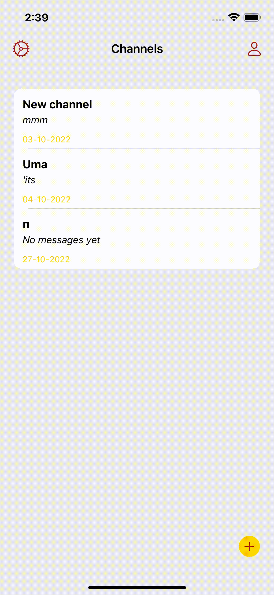
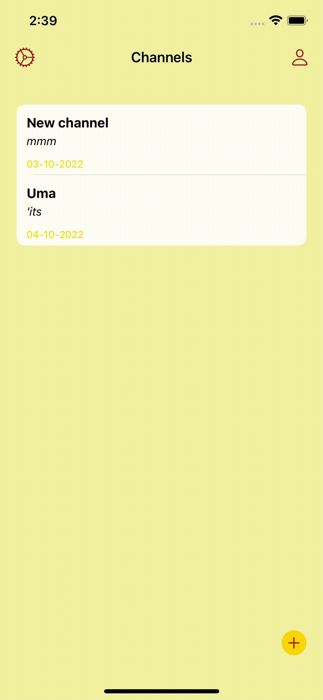
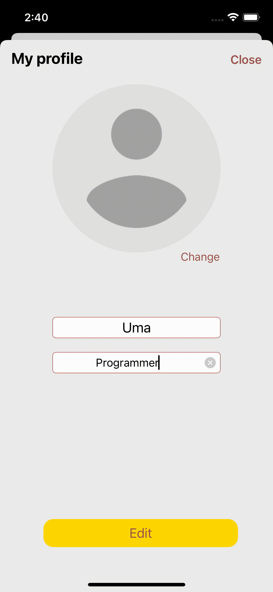

# Chat

## The main screen contains:
- The created channels.
- Clicking on the TableView element opens a screen with messages in choosen channel.
- Deletion channel is possible with a swipe.
- Buttons on NavBar: Left one for opening theme settings screen. Right one for opening user settings screen

## The channel screen:

## The theme settings screen

## The user settings screen contains:
- Avatar, username, bio.  User can change all of three. 

